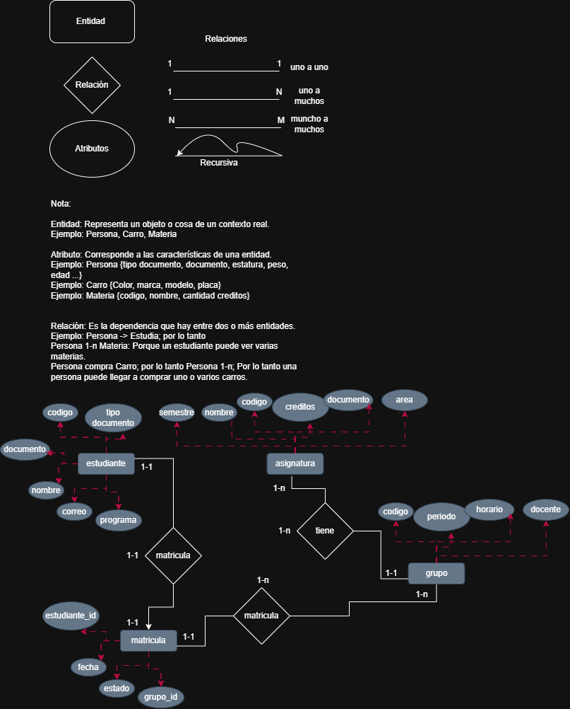

# Reflexión de Clase
## En esta primera sesión hemos identificado los componentes básicos del modelo ER. En la siguiente sesión profundizaremos en:
- En esta primera sesión hemos identificado los componentes básicos del modelo ER. En la siguiente sesión profundizaremos en:

- Cardinalidad: ¿Cuántas instancias de una entidad se relacionan con cuántas de otra?
- Participación: ¿Es obligatorio u opcional participar en una relación?
  
Construcción del diagrama ER completo 
#### Pregunta para reflexionar: 
- ¿Qué otras entidades podrían ser necesarias en un sistema académico real? Piensa en: aulas, horarios, prerrequisitos, calificaciones parciales...
### IMAGEN DE REFERENCIA CLASE ANTERIOR

# DESARROLLO
- CARDINALIDAD: esto define el numero de instancias de una entidad que puede asociarce con otra, por ejemplo un profesor puede dictar muhcas asignaturas (1 - N), pero un numero de cedula solo pertenece a una persona (1 - 1).
- PARTICIPACION: determina si la existencia de una entidad depende de una relacion con otra sea obligatoria u opcional. ejemplo, un consultorio y un medico puede haber un medcio sin un consultorio asigando y funciona pero no un consultorio sin un medico asignado.
- contruccion del diagrama completo

- este diagrama se puede observar que el cliente tiene una participacion total ya que si no hya cliente no hay producto ni pedido, con una cardinalidad de (1- N) respecto a la cantidad de pedidos que puede realizar.
- tambien se puede observar que tiene una cardinalidad de (N - N) ya que muchos pedidos puede tener muchos prodcutos
- su relacion es de realizar y contener, realiza n pedidos y ese n pedidos tiene n productos

- en ese ejemplo sus atributos son los mas basicos para cada entidad
