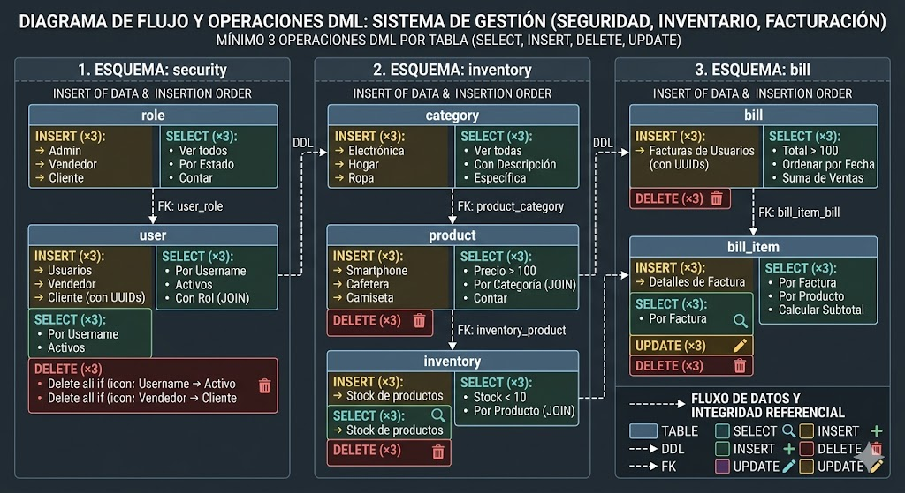

# QUIZ
## ¿ QUE SON LAS SENTENCIAS DML?
DML significa Data Manipulation Lenguage (Lenguaje de manipulacion de datos), a diferencia del DDL (DATA DEFINITION LENGUAGE)  que se usa para crear tablas o esquemas, el DML se utiliza para gestionar los datos dentro de esas estructuras.

Las sententicas principales son:

- SELECT: recuperar datosd e una o mas tablas
- INSERT: añade nuevas filas a una tabla
- UPDATE: modifica datos existentes 
- DELETE: elimina filas de una tabla

# INSERT

para poder empezar a inster algun insert en cualquier tabla debemos seguir el flujo con el que va el trabajo
- roles (necesarios para los usuarios), usuarios (necesario para las facturas), categorias (necesario apra los productos), productos (necesario para el inventario y detalle de facturas)

## tabla security.role

INSERT INTO security.role (name, description, state)
VALUES ('Admin', 'Acceso total al sistema', 'ACTIVE'); 

INSERT INTO security.role (name, description, state)
VALUES ('Vendedor', 'Gestión de ventas e inventario', 'ACTIVE'); 

INSERT INTO security.role (name, description, state)
VALUES ('Cliente', 'Acceso a historial de compras', 'ACTIVE'); 

##  tabla security.user

INSERT INTO security."user" (username, email, password, role_id, state)
VALUES ('juan_admin', 'juan@empresa.com', 'clave_segura_123', 'ID', 'ACTIVE');

##  Tabla inventory.category

INSERT INTO inventory.category (name, description)
VALUES ('Electrónica', 'Dispositivos y accesorios tecnológicos'); 

INSERT INTO inventory.category (name, description)
VALUES ('Hogar', 'Artículos para cocina y decoración'); 

INSERT INTO inventory.category (name, description)
VALUES ('Ropa', 'Prendas de vestir para adultos y niños'); 

##  tabla invetory.product

INSERT INTO inventory.product (name, description, price, category_id)
VALUES ('Smartphone X', 'Teléfono de última generación con 128GB', 799.99, 'ID_CATEGORIA_ELECTRONICA');

INSERT INTO inventory.product (name, description, price, category_id)
VALUES ('Cafetera Express', 'Cafetera automática con espumador de leche', 120.50, 'ID_CATEGORIA_HOGAR');

INSERT INTO inventory.product (name, description, price, category_id)
VALUES ('Camiseta de Algodón', 'Camiseta básica 100% algodón talla M', 15.00, 'ID_CATEGORIA_ROPA');

##  tabla inventory. product

INSERT INTO inventory.product (name, description, price, category_id)
VALUES ('Smartphone X', 'Pantalla 6.5 pulgadas y 128GB', 799.99, 'ID_ELECTRONICA'); 

INSERT INTO inventory.product (name, description, price, category_id)
VALUES ('Cafetera Pro', 'Presión de 15 bares para espresso', 145.50, 'ID_HOGAR'); 

INSERT INTO inventory.product (name, description, price, category_id)
VALUES ('Camiseta Premium', '100% algodón orgánico talla L', 25.00, 'ID_ROPA'); 

##  tabla inventory. inventory

INSERT INTO inventory.inventory (product_id, quantity)
VALUES ('ID_SMARTPHONE_X', 50); --

INSERT INTO inventory.inventory (product_id, quantity)
VALUES ('ID_CAFETERA_PRO', 20); --

INSERT INTO inventory.inventory (product_id, quantity)
VALUES ('ID_CAMISETA_PREMIUM', 100); --

##  tabla bill.bill

INSERT INTO bill.bill (user_id, total) VALUES ('ID_USUARIO_1', 824.99); 
INSERT INTO bill.bill (user_id, total) VALUES ('ID_USUARIO_2', 145.50); 
INSERT INTO bill.bill (user_id, total) VALUES ('ID_USUARIO_3', 50.00);

## tabla bill bill factura

INSERT INTO bill.bill_item (bill_id, product_id, quantity, unit_price, total)
VALUES ('ID_FACTURA_1', 'ID_SMARTPHONE_X', 1, 799.99, 799.99); 

INSERT INTO bill.bill_item (bill_id, product_id, quantity, unit_price, total)
VALUES ('ID_FACTURA_2', 'ID_CAFETERA_PRO', 1, 145.50, 145.50); 

INSERT INTO bill.bill_item (bill_id, product_id, quantity, unit_price, total)
VALUES ('ID_FACTURA_3', 'ID_CAMISETA_PREMIUM', 2, 25.00, 50.00);

# SELECT

Para verificar los insert de cada tabla, se usa el comando 
1.
- Roles: SELECT * FROM security.role;
- Usuarios: SELECT * FROM security."user";
- Categorias: SELECT * FROM inventory.category;

2. 
consultas con filtros (WHERE)

SELECT name, price
FROM inventory.product
WHERE price > 100; 

3. 
CONSULTA RELACIONADAS (JOINS)

SELECT u.username, r.name AS role_name
FROM security."user" u
JOIN security.role r ON u.role_id = r.id; 

# DELETE (Eliminación)

DELETE FROM bill.bill_item WHERE quantity = 0; (Borra ítems sin cantidad)

DELETE FROM inventory.inventory WHERE quantity < 0; (Limpia errores de stock)

DELETE FROM security.form WHERE name = 'Formulario_Prueba';

# UPDATE (Actualización)

UPDATE inventory.product SET price = price * 1.10 WHERE name = 'Smartphone X'; (Sube el precio 10%)

UPDATE security."user" SET state = 'INACTIVE' WHERE username = 'juan_admin';

UPDATE inventory.inventory SET quantity = quantity + 10 WHERE product_id = 'ID_PROD';

